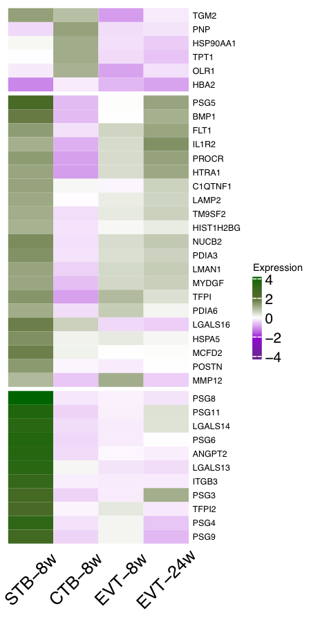
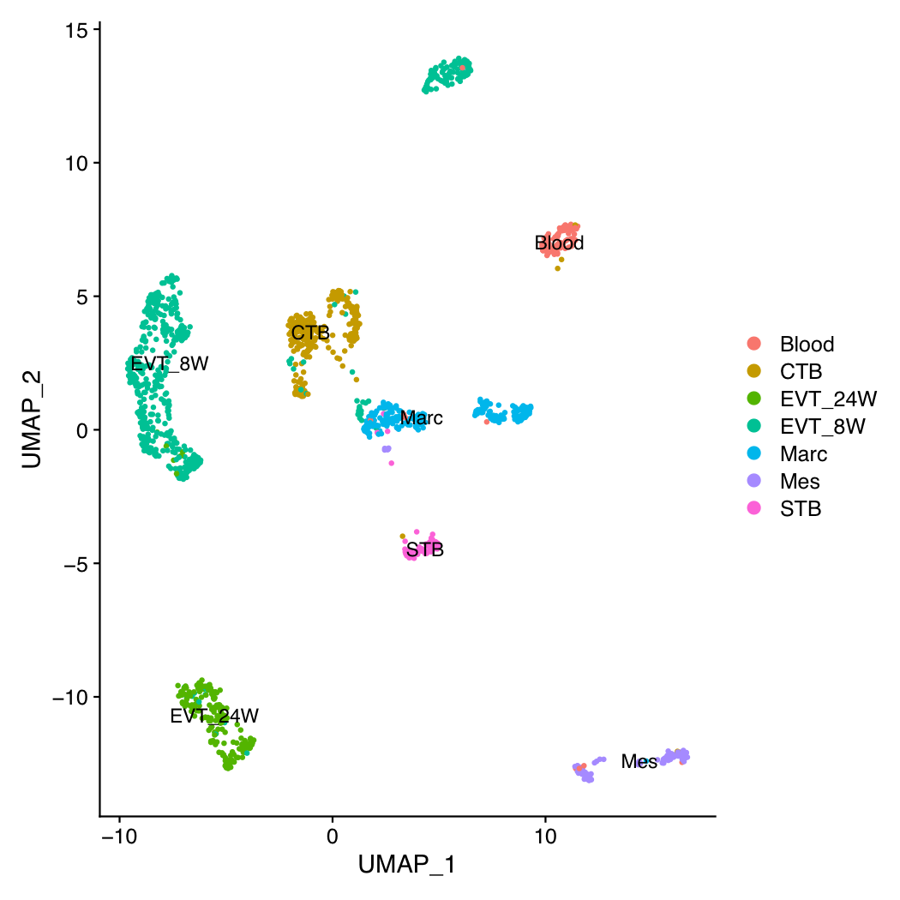
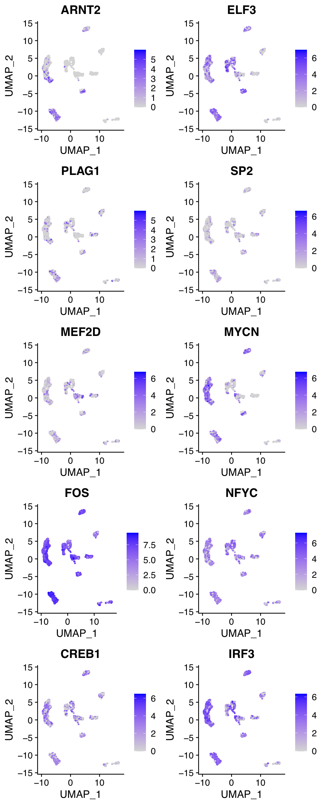
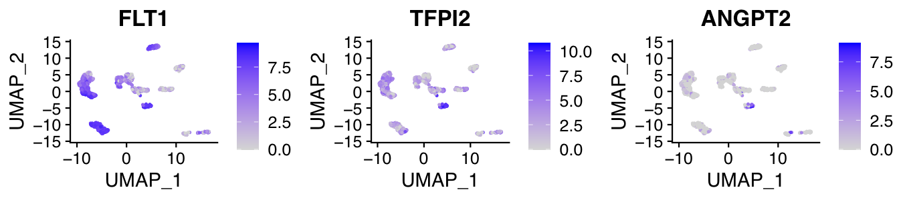

# Placental secretome map identifies potential diagnostic and treatment targets for pregnancy complications

Analyse the placental peptidome and secretome with mass spectrometry(MS) to improve understanding of the placental endocrinology and its significance in determining pregnancy outcome.

Napso T<sup>1</sup>, Zhao X<sup>1</sup>, Ibañez Lligoña M<sup>1</sup>, Sandovici I<sup>1,3</sup> , Kay RG<sup>2</sup>, Gribble F<sup>2</sup>, Reimann F<sup>2</sup>, Meek C<sup>2</sup>, Hamilton RS<sup>1,4</sup>, Sferruzzi-Perri AN<sup>1*</sup>. <br>

<sup>1</sup> Centre for Trophoblast Research, Department of Physiology, Development and Neuroscience, University of Cambridge, Cambridge, UK. <br>
<sup>2</sup> Wellcome-MRC Institute of Metabolic Science, Addenbrooke's Hospital, Cambridge, UK.<br>
<sup>3</sup> Metabolic Research Laboratories, MRC Metabolic Diseases Unit, Department of Obstetrics and Gynaecology, The Rosie Hospital, Cambridge, UK.<br>
<sup>4</sup> Department of Genetics,University of Cambridge, Downing Street, Cambridge, CB2 3EH, UK.<br>

<sup>1*</sup> corresponding author: ans48@cam.ac.uk<br>

Code Release to accompany paper: []

## Bioinformatics analysis Methods
Protein/peptide annotations in LC-MS datasets were converted to their gene accession ID via UniProt (https://www.uniprot.org/uploadlists/). Gene lists were then overlaid with publicly available datasets for the mouse and human placenta, which are detailed in Table 1 (3 from mouse placenta and 8 for human placenta). Mouse-human ortholog searches were also undertaken using three sources data, MGI (http://www.informatics.jax.org/) , NCBI (https://www.ncbi.nlm.nih.gov/homologene) and Ensembl (biomaRt_2.42.1  and homologene_1.4.68 in R_v3.6.2). Then using  R (version 3.6.2) generated a combined ortholog list for Mouse-Human, details of the list and Rscript is published in GitHub (https://github.com/CTR-BFX/2020-Napso_Sferruzi-Perri).  Mouse-human ortholog results were classified as one-to-one when a gene/protein from mouse was found at the end of a node in human. Any results classified as one-to-many were excluded. Gene ontology analyses were performed using both STRING and Panther tools (Ashburner et al. 2000). Gene enrichment analyses were conducted using TissueEnrich (tissue-specific gene enrichment analysis; (Jain and Tuteja 2019)), which utilises datasets available in the Human Protein Atlas compiling RNAseq datasets from 35 human tissues (Uhlen et al. 2015) and the Mouse ENCODE database comprised of RNAseq datasets of 17 mouse tissues (Shen et al. 2012). Refined gene/protein lists were overlaid with publicly available RNA and protein expression datasets for human pregnancy complications (Table 2) and aided by searches in Pubmed and the OMIM repository (http://www.ncbi.nlm.nih.gov). All data outputs at each step of the pipeline, including the proteins/genes expressed in the mouse but not the human placenta can be found in GitHub (https://github.com/CTR-BFX/2020-Napso_Sferruzi-Perri).  
<bf>{However, please note that due to slight changes / updates in ENSEMBL numbers, there may be some variability in the final number of genes identified following conversion from protein.}

To further refine our lists to secreted proteins, we applied SignalP (Signal Peptide Prediction, version 4.1, Nielsen et al. 2019)  and gene ontology analysis using four different gene ontology (GO) terms: extracellular region (GO: 0005615), extracellular exosome (GO: 0070062), extracellular region parts (GO: 0005615) and signal IP (excluding signals detected for ER lumen proteins). This combination analysis is because SignalP can only detect the signal peptide for proteins secreted via the canonical route, which is normally called as "classic" or "conventional" secretion pathway. In addition, eukaryotic cells also utilize unconventional protein secretion (UPS) for protein sorting and delivery, which we called "unconventional" secretion pathway, eg.leaderless proteins, into the extracellular medium. (Kim et al, 2018) Thus, we apply both "conventional" and "unconventional" seceretion pathways analysis to identify our secreted proteins' list. This resulted in a refined list of 158 and 257 secreted proteins detected in the cultured cells and conditioned medium (110 were common between the sample types), respectively that are expressed by both the mouse and human placenta.

More details and corresponding files linked to the paper are given below:

### Step 1: Get the secretome Mass Spectrum (MS) datasets.
   | | Files | Name   |
   | --------- | ----------------------------- | --- |
   |PEAKS|Cultured_Primary_Trophoblast_Data.csv |[[CSV](Original_Data/Cultured_Primary_Trophoblast_Data.csv)]|
   |Scaffold |Conditional_Medium_Data.csv |[[CSV](Original_Data/Conditional_Medium_Data.csv)]|
   |Scaffold/Excel| Sorted_Trophblast_Cells_Data.xlsx| [[XLSX](Original_Data/Sorted_Trophblast_Cells_Data.xlsx)]|

### Step 2: Secretome analysis
  ### Extract Mouse Proteins, corresponding gene name and UniProtKB ID;
  | Files | Name   |
  | ----------------------------- | --- |
  |Cultured_Trophoblast_N1534_G1531_Gnas_Naca_Gpx4_Filtered_pep2_Step1_Data.csv | [[CSV](Figures_Tables/Cultured_Trophoblast_N1534_G1531_Gnas_Naca_Gpx4_Filtered_pep2_Step1_Data.csv)] |
  |Conditioned_Medium_Trophoblast_N1445_G1441_Psg16_Pkm_Tpm1_Fbln1_Step1_Data.csv | [[CSV](Figures_Tables/Conditioned_Medium_Trophoblast_N1445_G1441_Psg16_Pkm_Tpm1_Fbln1_Step1_Data.csv)] |
  |Sorted_cell_Trophoblast_N1142_Step1_Data.csv|  [[CSV](Figures_Tables/Sorted_cell_Trophoblast_N1142_Step1_Data.csv)]|

  ### QC control:  </bt>
      [1] number of unique peptides >= 2 &  -10log(10)P > 12.7  (padj < 0.05);
      [2] minimum samples choosen ( 2 out 3 or 4 out of 5);


| Files | Download   |
| ----------------------------- | --- |
|Cultured_Trophoblast_N1208_G1206_Gnas_Naca_Filtered_Step2_Data.csv | [[CSV](Figures_Tables/Cultured_Trophoblast_N1208_G1206_Gnas_Naca_Filtered_Step2_Data.csv)] |
|Conditional_Medium_D924_G922_Psg16_Pkm_Filtered_Step2_Data.csv | [[CSV](Figures_Tables/Conditional_Medium_D924_G922_Psg16_Pkm_Filtered_Step2_Data.csv)] |
|Sorted_TrophoblastP_N654_G653_Naca_Filtered_Step2_correctGeNames_Data.csv|  [[CSV](Figures_Tables/Sorted_TrophoblastP_N654_G653_Naca_Filtered_Step2_correctGeNames_Data.csv)]|


### Literature review and Data preparation for placenta Data (Mouse and Human), includes Control and other pregnancy complications. (Need to replaced by Table 1 and 2 final version)
GEO_DataSet_Summary.pdf [[PDF](Figures_Tables/GEO_DataSet_Summary.pdf)]

  #### Orthology analysis (NCBI, Ensembl and MGI)
  | OrthologFile | Download   |  Legend |
  | ----------------------------- | --- | --- |
  |CTR_ans48_0003-Ensembl_MGI_NCBI_human_mouse_upsetR_plot_april_2020.pdf | [[PDF](Figures_Tables/CTR_ans48_0003-Ensembl_MGI_NCBI_human_mouse_upsetR_plot_april_2020.pdf)]|UpsetR plot showing the overlap and unique numbers of ortholog among three data source |
  |CTR_ans48_0003-Ensemble_MGI_NCBI_human_mouse_Homolog_april_2020.csv|  [[CSV](Original_Data/CTR_ans48_0003-Ensemble_MGI_NCBI_human_mouse_Homolog_april_2020.csv)]| Combined three source data for ortholog list|


### Overlap with public data (Corresponding to Fig 1G & Fig 2F)</bt>
  | Files | Name   |
  | ----------------------------- | --- |
  |GEO_Control_Mouse_D3_N47936_GeneName_List.csv|[[CSV](Original_Data/GEO_Control_Mouse_D3_N47936_GeneName_List.csv)] |
  |GEO_Control_Human_D8_N36552_GeneName_List.csv|[[CSV](Original_Data/GEO_Control_Human_D8_N36552_GeneName_List.csv)] |
  |Cultured_Trophoblast_N1180_G1178_Gnas_Naca_Filtered_pep2_Step3_MousePub_Data.csv | [[CSV](Figures_Tables/Cultured_Trophoblast_N1180_G1178_Gnas_Naca_Filtered_pep2_Step3_MousePub_Data.csv)] |
  |Cultured_Trophoblast_N1170_G1168_Gnas_Naca_Filtered_pep2_Step3_HumPub_Data.csv | [[CSV](Figures_Tables/Cultured_Trophoblast_N1170_G1168_Gnas_Naca_Filtered_pep2_Step3_HumPub_Data.csv)] |
  |Cultured_Trophoblast_N10_G10_Filtered_pep2_Step4_MusUni_Data.csv | [[CSV](Figures_Tables/Cultured_Trophoblast_N10_G10_Filtered_pep2_Step4_MusUni_Data.csv)] |
  |Conditioned_Medium_Trophoblast_N908_G906_Psg16_Pkm_Filtered_Step3_MousePub_Data.csv|  [[CSV](Figures_Tables/Conditioned_Medium_Trophoblast_N908_G906_Psg16_Pkm_Filtered_Step3_MousePub_Data.csv)]|
  |Conditioned_Medium_Trophoblast_N876_G875_Psg16_Filtered_Step3_HumPub_Data.csv | [[CSV](Figures_Tables/Conditioned_Medium_Trophoblast_N876_G875_Psg16_Filtered_Step3_HumPub_Data.csv)] |
  |Conditioned_Medium_Trophoblast_N33_G32_Filtered_Step4_MusUni_Data.csv | [[CSV](Figures_Tables/Conditioned_Medium_Trophoblast_N33_G32_Filtered_Step4_MusUni_Data.csv)] |
  |Sorted_cell_Trophoblast_N621_G620_Naca_Filtered_Step3_MousePub_Data.csv | [[CSV](Figures_Tables/Sorted_cell_Trophoblast_N621_G620_Naca_Filtered_Step3_MousePub_Data.csv)] |
  |Sorted_cell_Trophoblast_N611_G610_Naca_Filtered_Step3_HumPub_Data.csv|  [[CSV](Figures_Tables/Sorted_cell_Trophoblast_N611_G610_Naca_Filtered_Step3_HumPub_Data.csv)]|
  |Sorted_cell_Trophoblast_N10_G10_Filtered_Step4_MusUni_Data.csv|  [[CSV](Figures_Tables/Sorted_cell_Trophoblast_N10_G10_Filtered_Step4_MusUni_Data.csv)]|

### Secreted Identification for common proteins between Mouse and Human and Mouse Unique ones, (Correponding to Fig 3A)
      [1] SignalP (version 4.1)[[Link](http://www.cbs.dtu.dk/services/SignalP-4.1/)];
      [2] UniProt.ws (version 2.26.0) package in R (version 3.6.2), GO pathway with "extracellular";
      [3] leftover manually checking;

| Files | Name   |
| ----------------------------- | --- |
|Cultured_Trophoblast_secretedList_SignalP_GO_Tina_N177_G177.csv | [[CSV](Figures_Tables/Cultured_Trophoblast_secretedList_SignalP_GO_Tina_N177_G177.csv)] |
|Conditioned_Medium_Trophoblast_secretedList_SignalP_GO_Tina_N270_G269_Pkm.csv | [[CSV](Figures_Tables/Conditioned_Medium_Trophoblast_secretedList_SignalP_GO_Tina_N270_G269_Pkm.csv)] |
|Sorted_cell_Trophoblast_secretedList_SignalP_GO_Tina_N102_G102.csv | [[CSV](Figures_Tables/Sorted_cell_Trophoblast_secretedList_SignalP_GO_Tina_N102_G102.csv)] |
|Cultured_ConditionM_SortedC_Trophoblast_secretedList_N360_G333.csv|  [[CSV](Figures_Tables/Cultured_ConditionM_SortedC_Trophoblast_secretedList_N360_G333.csv)]|
|Secreted_Final_List_Tina.xlsx|[[XLSX](Figures_Tables/Secreted_Final_List_Tina.xlsx)]|

### Secreted proteins/genes overlap with singleCell RNASeq data for cell type identification;
      Yawei Liu, Xiaoying Fan, Rui Wang, Xiaoyin Lu, Yan-Li Dang, Huiying Wang, Hai-Yan Lin, Cheng Zhu, Hao Ge, James C. Cross & Hongmei Wang [[DOI](https://doi.org/10.1038/s41422-018-0066-y)]

| Files | Download   | Fig. | Images|
| ----------------------------- | --- | ---| ---|
|Secreted_N325_Psg22Drop_SelN301_scRNA_Heatmap_June_2020_addEVT24.pdf | [[PDF](Figures_Tables/Secreted_N325_Psg22Drop_SelN301_scRNA_Heatmap_June_2020_addEVT24.pdf)] | ---|  |
|Secreted_Protien_N325_Psg22Drop_SelN301_scRNA_Heatmap_N301_selGenes38_8w_STB1_CTB1_EVT1_EVT21_June_2020_new.pdf | [[PDF](Figures_Tables/Secreted_Protien_N325_Psg22Drop_SelN301_scRNA_Heatmap_N301_selGenes38_8w_STB1_CTB1_EVT1_EVT21_June_2020_new.pdf)] | Fig 3F| |
|scRNA_overlap_secretedList.csv|[[CSV](Figures_Tables/scRNA_overlap_secretedList.csv)]| ---| ---|
|TF_check.xlsx|[[XLSX](Figures_Tables/TF_check.xlsx)]|TF list check with scRNASeq|| ---|
|TF_list1_oversc_N23.csv|[[CSV](Figures_Tables/TF_list1_oversc_N23.csv)]| TF list1 check with scRNASeq| ---|
|TF_list2_oversc_N74_Drop3_EVX1_FOXA2_HNF1A.csv|[[CSV](Figures_Tables/TF_list2_oversc_N74_Drop3_EVX1_FOXA2_HNF1A.csv)] |TF list2 check with scRNASeq| ---|
|TF_list3_oversc_N74_Drop2_FOXA2_HNF1A.csv|[[CSV](Figures_Tables/TF_list3_oversc_N74_Drop2_FOXA2_HNF1A.csv)] |TF list3 check with scRNASeq| ---|
|Dimplot_scRNA_Liu.pdf|[[PDF](Figures_Tables/Dimplot_scRNA_Liu.pdf)] | UMAP plot for Liu's scRNASeq paper| |
|FeaturePlot_scRNA_TFMarker_Liu.pdf|[[PDF](Figures_Tables/FeaturePlot_scRNA_TFMarker_Liu.pdf)] | Featureplot for TF markers in Fig 5||
|FeaturePlot_scRNA_UniMarker_Liu.pdf|[[PDF](Figures_Tables/FeaturePlot_scRNA_UniMarker_Liu.pdf)] |Key markers enrich in scRNA STB from secreted list | |


## Software Versions & Methods

````
R version 3.6.2 (2019-12-12)
Platform: x86_64-apple-darwin15.6.0 (64-bit)
Running under: macOS  10.14.4

Platform: x86_64-pc-linux-gnu (64-bit)
Running under: Ubuntu 16.04.6 LTS

Matrix products: default
BLAS:   /storage/Software/packages/R-3.6.2/lib/libRblas.so
LAPACK: /storage/Software/packages/R-3.6.2/lib/libRlapack.so

Random number generation:
 RNG:     Mersenne-Twister
 Normal:  Inversion
 Sample:  Rounding

locale:
 [1] LC_CTYPE=en_GB.UTF-8       LC_NUMERIC=C              
 [3] LC_TIME=en_GB.UTF-8        LC_COLLATE=en_GB.UTF-8    
 [5] LC_MONETARY=en_GB.UTF-8    LC_MESSAGES=en_GB.UTF-8   
 [7] LC_PAPER=en_GB.UTF-8       LC_NAME=C                 
 [9] LC_ADDRESS=C               LC_TELEPHONE=C            
[11] LC_MEASUREMENT=en_GB.UTF-8 LC_IDENTIFICATION=C       

attached base packages:
 [1] grid      stats4    parallel  stats     graphics  grDevices utils    
 [8] datasets  methods   base   

 other attached packages:
  [1] lattice_0.20-41             circlize_0.4.9             
  [3] ComplexHeatmap_2.5.1        rhdf5_2.30.1               
  [5] mltools_0.3.5               bigmemory_4.5.36           
  [7] scater_1.14.6               scran_1.14.6               
  [9] SingleCellExperiment_1.8.0  SummarizedExperiment_1.16.1
 [11] DelayedArray_0.12.3         BiocParallel_1.20.1        
 [13] matrixStats_0.56.0          Biobase_2.46.0             
 [15] GenomicRanges_1.38.0        GenomeInfoDb_1.22.1        
 [17] IRanges_2.20.2              S4Vectors_0.24.4           
 [19] biomaRt_2.42.1              reshape2_1.4.4             
 [21] useful_1.2.6                Matrix_1.2-18              
 [23] Seurat_3.1.5                cowplot_1.0.0              
 [25] ggplot2_3.3.0               dplyr_0.8.5                
 [27] readxl_1.3.1                UniProt.ws_2.26.0          
 [29] BiocGenerics_0.32.0         RCurl_1.98-1.2             
 [31] RSQLite_2.2.0  
 loaded via a namespace (and not attached):
  [1] BiocFileCache_1.10.2     plyr_1.8.6               igraph_1.2.5            
  [4] lazyeval_0.2.2           splines_3.6.2            listenv_0.8.0           
  [7] digest_0.6.25            htmltools_0.4.0          viridis_0.5.1           
 [10] fansi_0.4.1              magrittr_1.5             memoise_1.1.0           
 [13] cluster_2.1.0            ROCR_1.0-11              limma_3.42.2            
 [16] globals_0.12.5           askpass_1.1              prettyunits_1.1.1       
 [19] colorspace_1.4-1         blob_1.2.1               rappdirs_0.3.1          
 [22] ggrepel_0.8.2            crayon_1.3.4             jsonlite_1.6.1          
 [25] bigmemory.sri_0.1.3      survival_3.1-12          zoo_1.8-8               
 [28] ape_5.3                  glue_1.4.1               gtable_0.3.0            
 [31] zlibbioc_1.32.0          XVector_0.26.0           leiden_0.3.3  
  ....         
````

## Contact

Contact Xiaohui Zhao (xz289 -at- cam.ac.uk) & Russell S. Hamilton (rsh46 -at- cam.ac.uk)
